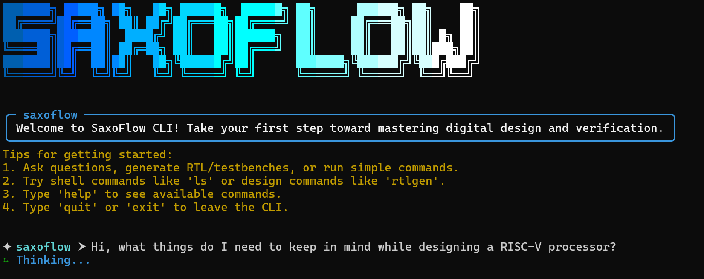

SaxoFlow is a beginner-friendly RTL **design suite** that unifies open-source EDA tools with an intelligent, Rich UI. It’s built to help learners and new designers move from **spec → RTL → sim/formal/synth** without hand-wiring a dozen utilities. The project targets **Linux and WSL** and ships with a clean workflow:

* a **Rich UI terminal app** (`python3 start.py`) with panels, shell-like UX, an **AI Buddy** for natural-language help, and **Agentic AI** quick actions (`rtlgen`, `tbgen`, `fpropgen`, `report`, `debug`, `fullpipeline`);
* a **unified CLI** (`saxoflow`) for environment initialization, tool installation, diagnostics, and make-style build helpers (simulation, waveforms, formal, synthesis, housekeeping).

Tool installers use **APT** and scripts in `scripts/recipes/`.

---

## ✅ Prerequisites

* **OS**: Linux or **WSL** (Ubuntu recommended)
* **Python**: 3.9+
* **System packages**: `git`, `build-essential`, `cmake` (typical dev stack)
* **Disk space**: several GB if you install the full toolchain (sim, formal, FPGA, ASIC)
* **(Optional) LLM access for AI features**
  Add at least one key to your shell or `.env`:

  ```bash
  export FIREWORKS_API_KEY="sk-***"
  # export OPENAI_API_KEY="sk-***"   # only if you enable OpenAI locally
  ```

---

## 🚀 Install & First Run

```bash
# 1) Clone
git clone https://github.com/saxoflowlabs/saxoflow-starter.git
cd saxoflow-starter

# 2) Create & activate venv
python3 -m venv .venv
source .venv/bin/activate

# 3) Install the package (provides the `saxoflow` CLI)
pip install -e .
```

### Start the Rich UI

```bash
python3 start.py
```

**Shell passthrough in the UI**

* **Editors only** use `!` (e.g., `!code .`, `!subl .`, `!gedit file.v`)
* **Regular Unix**: run as-is (`ls`, `pwd`, `cd`, …) — **no `!`**

---

## 🧭 Standard Workflow (CLI)

1. **Initialize environment (choose a preset)**
   Presets are defined in `saxoflow/installer/presets.py`:

   * `minimal` – IDE + a basic simulator + waveform viewer
   * `fpga` – Verilator + FPGA toolchain + base tools
   * `asic` – Verilator + ASIC P\&R/layout stack + base tools
   * `formal` – Yosys + SymbiYosys + IDE
   * `full` – IDE + SIM + FORMAL + FPGA + ASIC + BASE

   ```bash
   saxoflow init-env --preset <minimal|fpga|asic|formal|full>   # add --headless to skip prompts
   ```

2. **Install tools**

   ```bash
   saxoflow install selected   # from your last init-env selection
   saxoflow install all        # everything
   saxoflow install <tool>     # e.g., yosys, iverilog, verilator, openroad, gtkwave, ...
   ```

3. **Create a unit (project scaffold)**

   ```bash
   saxoflow unit <unitname>
   ```

   Add your **specification** (Markdown/text) to the unit’s **spec** folder. You’ll use this spec with the agentic generators.

4. **Build & run (from your project root)**

   ```bash
   saxoflow simulate
   saxoflow wave
   saxoflow formal
   saxoflow synth
   saxoflow clean
   saxoflow check_tools

   # Also available:
   saxoflow sim | sim_verilator | sim_verilator_run
   saxoflow wave_verilator
   saxoflow simulate_verilator
   ```

---

## 🤖 AI Features (in the Rich UI)

**Agentic quick actions** (from `saxoflow_agenticai`, integrated into the UI). Type a command + spec path:

```
rtlgen <spec.md>                # generate RTL
tbgen <spec.md>                 # generate testbench
fpropgen <spec.md>              # generate formal properties
report | debug                  # review/analysis
fullpipeline -i <spec.md> [--iters N]
```

**AI Buddy**
Open-ended chat right in the terminal—use it for design Q\&A, code reviews, or small refactors.

---

## 🔧 Supported Tools (current)

* **IDE**: `vscode`
* **Simulation**: `iverilog`, `verilator`
* **Waveforms**: `gtkwave`
* **Synthesis**: `yosys`
* **Formal**: `symbiyosys`
* **FPGA**: `nextpnr`, `openfpgaloader`, `vivado` (vendor/optional)
* **ASIC**: `openroad`, `klayout`, `magic`, `netgen`

Install recipes live in `scripts/recipes/`. Tool groups & presets are in `saxoflow/installer/presets.py`.

---

## 📦 Repository Map (high-level)

```
saxoflow/
  cli.py                 # unified CLI
  diagnose.py            # diagnose command group
  diagnose_tools.py      # env probes & health scoring
  makeflow.py            # sim/formal/synth/wave/clean glue
  installer/
    interactive_env.py   # init-env logic
    presets.py           # tool groups & presets
    runner.py            # APT/script installers
  tools/
    definitions.py       # tool metadata

saxoflow_agenticai/      # agentic actions (integrated in the Rich UI)
cool_cli/                # Rich UI terminal app (used by start.py)
scripts/recipes/*.sh     # tool installers
templates/               # project/Makefile templates
start.py                 # Rich UI entry point
```

---

## 🪪 License

Apache-2.0 (see `LICENSE`).

---

## 🧑‍💻 Maintainers

Built by [SaxoFlow Labs](https://github.com/saxoflowlabs) — a student-led initiative from TU Dresden.
