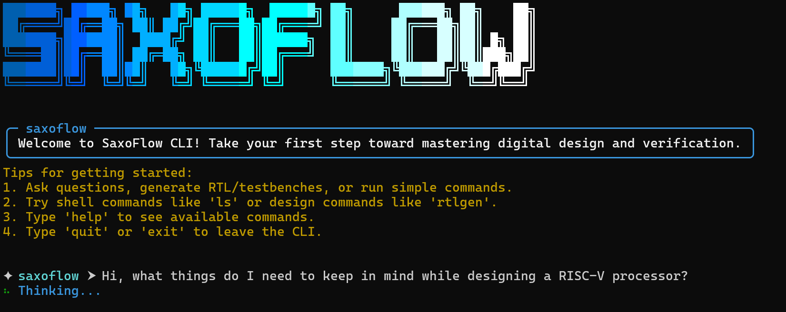

SaxoFlow is a beginner-friendly **hardware design suite** that unifies open-source EDA tools with an intelligent, Rich UI. It's built to help learners and new designers move from **spec → RTL → sim/formal/synth** without hand-wiring a dozen utilities. The project targets **Linux and WSL** and ships with a clean workflow:

* a **Rich UI terminal app** (`saxoflow`) with panels, shell-like UX, an **AI Buddy** for natural-language help, and **Agentic AI** quick actions (`rtlgen`, `tbgen`, `fpropgen`, `report`, `debug`, `fullpipeline`);
* a **unified CLI** (`saxoflow`) for environment initialization, tool installation, diagnostics, and make-style build helpers (simulation, waveforms, formal, synthesis, housekeeping).

Tool installers use **APT** and scripts in `scripts/recipes/`.

---

## ✅ Prerequisites

* **OS**: **WSL** or Linux (Ubuntu recommended)
* **Python**: 3.9+
* **System packages**: `git`, `build-essential`, `cmake` (typical dev stack)
* **Disk space**: several GB if you install the full toolchain (sim, formal, FPGA, ASIC)
* **LLM access for AI features**
Add an LLM API key. The supported providers are:
  - openai
  - anthropic
  - gemini
  - groq
  - mistral
  - fireworks
  - together
  - perplexity
  - deepseek
  - dashscope
  - openrouter

---

## 🚀 Install & First Run

```bash
# 1) Clone
git clone https://github.com/saxoflowlabs/saxoflow-starter.git
cd saxoflow-starter

# 2) Create & activate venv
python3 -m venv .venv
source .venv/bin/activate

# 3) Install SaxoFlow
python3 -m pip install -e .
```

### Start the Rich UI

```bash
saxoflow
```

The TUI starts in `~/SaxoFlow` by default, so users see their projects, copied examples, and SaxoFlow state instead of the application source tree. Override the workspace with `saxoflow --workspace /path/to/workspace` or `SAXOFLOW_WORKSPACE=/path/to/workspace saxoflow`.

---

## 🧭 Standard Workflow (CLI)

1. **Initialize environment (choose a preset)**
   Presets are defined in `saxoflow/installer/presets.py`:

   * `minimal` – IDE + a basic simulator + waveform viewer
   * `fpga` – Verilator + FPGA toolchain + base tools
   * `asic` – Verilator + ASIC P\&R/layout stack + base tools
   * `formal` – Yosys + SymbiYosys + IDE
   * `full` – IDE + SIM + FORMAL + FPGA + ASIC + BASE

   ```bash
   saxoflow init-env --preset <minimal|fpga|asic|formal|full>   # add --headless to skip prompts
   ```

2. **Install tools**

   ```bash
   saxoflow install selected   # from your last init-env selection
   saxoflow install all        # everything
   saxoflow install <tool>     # e.g., yosys, verilator, openroad, orfs, ...
   ```

3. **Create a unit (project scaffold)**

   ```bash
   saxoflow unit <unitname>
   ```

   Add your **specification** (Markdown/text) to the unit’s **spec** folder. You’ll use this spec with the agentic generators.

4. **Build & run (from your project root)**

   ```bash
   saxoflow simulate
   saxoflow lint
   saxoflow wave
   saxoflow formal
   saxoflow synth
   saxoflow schematic
   saxoflow pdk list
   saxoflow pnr status
   saxoflow clean
   saxoflow check_tools

   # Also available:
   saxoflow sim | sim_verilator | sim_verilator_run
   saxoflow wave_verilator
   saxoflow simulate_verilator
   ```

   `saxoflow lint` recursively discovers Verilog and SystemVerilog RTL under
   `source/rtl/`, runs every available Verible and Verilator lint engine, and
   stores raw reports in `lint/reports/`. Use `--rtl PATH` for custom source
   locations, `--include DIR` for Verilator include directories,
   `--top MODULE` for Verilator elaboration, and `--include-tb` to include
   testbench files.

   `saxoflow synth` discovers `.v` and `.sv` files under `source/rtl/` and
   `synthesis/src/`, selects the Slang frontend when available, and writes the
   reproducible runtime script and reports under `synthesis/reports/`. The
   complete Yosys log is also displayed in the CLI. When NetlistSVG is
   installed, synthesis automatically renders
   `synthesis/reports/schematic.svg` and opens it in the desktop viewer. Under
   WSL, SaxoFlow uses `wslview` or Windows interop automatically.
   Explicit source paths, top modules, target profiles, output formats, and
   ASIC Liberty mapping are available through command options:

   ```bash
   saxoflow synth --rtl custom/rtl --top sample_core
   saxoflow synth --target ice40 --top sample_core --device hx
   saxoflow synth --target asic --top sample_core \
     --liberty constraints/cells.lib --clock-period 2.5
   saxoflow synth --no-show-log --no-open-schematic
   saxoflow synth --script synthesis/scripts/synth.ys
   saxoflow synth --script custom.ys --schematic-input custom-output.json
   saxoflow schematic --input synthesis/out/synthesized.json
   saxoflow schematic --no-open
   saxoflow install netlistsvg
   ```

   The NetlistSVG installer reuses Node.js from the current `PATH` or an
   existing NVM installation. If neither is available, it installs Ubuntu's
   `nodejs` and `npm` packages.

   Physical design uses OpenROAD Flow Scripts while preserving OpenROAD as a
   separately installed tool. Install and activate only the platform needed by
   the current project:

   ```bash
   saxoflow install openroad
   saxoflow install orfs
   saxoflow pdk list
   saxoflow pdk info gf180mcu
   saxoflow pdk install sky130hd --accept-license
   saxoflow diagnose pnr --platform sky130hd
   ```

   Initialize the project with an explicit platform, library, timing corner,
   top module, mapped netlist, and constraints:

   ```bash
   saxoflow pnr init --platform sky130hd --top sample_core \
     --netlist synthesis/out/synthesized.v --sdc constraints/design.sdc
   saxoflow pnr floorplan
   saxoflow pnr place
   saxoflow pnr cts
   saxoflow pnr route
   saxoflow pnr finish
   saxoflow pnr report
   saxoflow pnr gui --stage route
   ```

   `saxoflow pnr run --synthesize` explicitly performs platform-aware Yosys
   synthesis before handing the mapped netlist to ORFS. OpenROAD itself does
   not perform RTL synthesis. Platform choices are locked in
   `pnr/platform.lock.yaml`; generated ORFS configuration and experiment
   variants remain inspectable under `pnr/`.

   ORFS is installed as a sparse, pinned checkout. Platform collateral is
   materialized only by `saxoflow pdk install`, and `saxoflow pdk remove`
   removes only SaxoFlow-managed files. External custom PDK roots are never
   copied or deleted. GF180MCU exposes both 9-track and 7-track 5 V libraries.
   ASAP7 is a research platform and requires an externally mapped netlist
   because its ORFS timing setup combines multiple Liberty views.

   ```bash
   saxoflow pdk template --output platform.yaml
   saxoflow pdk register --manifest platform.yaml \
     --root /path/to/external/platform
   ```

---

## 🤖 AI Features (in the Rich UI)

**Agentic quick actions** (from `saxoflow_agenticai`, integrated into the UI). Type a command + spec path:

```
rtlgen <spec.md>                # generate RTL
tbgen <spec.md>                 # generate testbench
fpropgen <spec.md>              # generate formal properties
report | debug                  # review/analysis
fullpipeline -i <spec.md> [--iters N]
```

**AI Buddy**
Open-ended chat right in the terminal—use it for design Q\&A, code reviews, or small refactors.

---

## 🔧 Supported Tools (current)

* **IDE**: `vscode`
* **Simulation / verification**: `icarus-verilog`, `verilator`, `nvc`, `cocotb`, `covered`
* **RTL linting**: `verible`, with Verilator semantic linting when installed
* **Waveforms / debugging**: `gtkwave`, `surfer`
* **Synthesis / Frontend**: `yosys`, `netlistsvg`, `surelog`, `sv2v`
* **Formal verification**: `symbiyosys`, `z3`, `boolector`, `bitwuzla`, `vices`, `cvc5`
* **FPGA / SoC orchestration**: `nextpnr`, `openfpgaloader`, `vivado` (vendor/optional), `fusesoc`, `rggen`
* **ASIC / Physical design**: `openroad`, `orfs`, `opensta`, `klayout`, `magic`, `netgen`, `rggen`
* **Embedded software / RISC-V**: `riscv-toolchain`, `spike`, `qemu`
* **Dependency / Flow orchestration**: `bender`, `fusesoc`, `edalize`, `kact2`, `silicon-compiler`, `risc-v-gnu-toolchain`, `pyphpips`, `ccola-system-sim`, `opentus`, `genie`

Install recipes live in `scripts/recipes/`. Tool groups & presets are in `saxoflow/installer/presets.py`.

---

## 🪪 License

Apache-2.0 (see `LICENSE`).

---

## 🧑‍💻 Maintainers

Built by [SaxoFlow Labs](https://github.com/saxoflowlabs)
